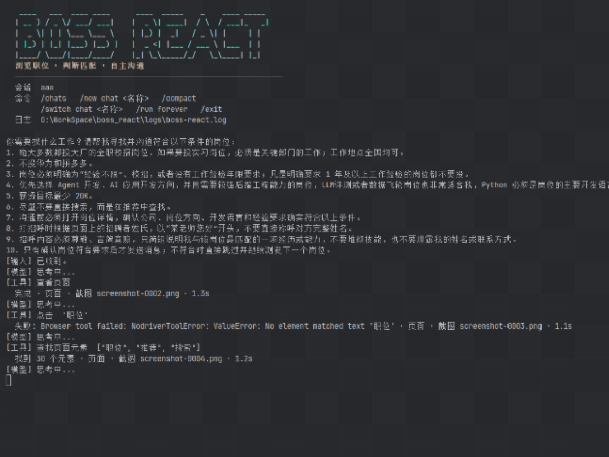
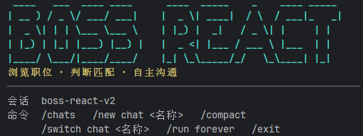

<div align="center">

<h1>BOSS React</h1>

<p><strong>像使用 Coding Agent 一样，交互式寻找并沟通工作机会。</strong></p>

<p>
  
  
  
  
</p>

<p>BOSS 的页面在变，自动化限制也在更新。我们目前绕过了所有阻碍，构建了这个全自动化agent。您可以关注项目，我们会针对boss最新的护栏更新。</p>

<p>
  <a href="#2-怎么使用">交互命令</a> ·
  <a href="#3-快速开始">快速开始</a> ·
  <a href="#4-它如何工作">工作原理</a> ·
  <a href="#6-技术亮点">技术亮点</a>
</p>

</div>

<p align="center">
  <a href="assests/images/运行演示.gif"></a>
  <a href="assests/images/运行截图.png"></a>
</p>

在终端说出目标，Agent 会观察页面、打开职位、阅读要求、判断匹配，再决定是否沟通。工具调用和结果实时可见；按 `Esc` 暂停，补充要求后从检查点继续。

## 1. 像 Coding Agent 一样交互

启动后进入持续对话的命令行界面。会话、命令和下一条任务都在这里。



运行时，模型的判断、工具调用、页面状态和发送结果会逐步显示。工作中按 `Esc`，当前步骤结束后就回到输入框。

它不是固定脚本：下一步点哪里、岗位是否合适，由模型结合你的要求、简历事实和当前页面决定。**发送消息是真实操作**，请在任务中写清筛选条件和沟通边界。

## 2. 怎么使用

在提示符输入自然语言任务，例如：

```text
请在推荐职位里寻找适合我的 Agent 开发或 AI 应用开发校招岗位。
先打开详情确认公司、经验要求和技术方向；符合要求再礼貌地发送简短招呼。
遇到需要我处理的登录或异常时暂停并说明情况。
```

| 输入 / 操作 | 作用 |
| --- | --- |
| 自然语言任务 | 开始任务；已有会话从检查点继续 |
| `Esc` | 当前模型或工具步骤结束后暂停，返回输入 |
| `/run forever` | 在已有任务会话中持续运行；按 `Esc` 停止 |
| `/compact` | 手动压缩当前会话上下文，完成后等待再次输入 |
| `/chats` | 列出保存过的会话 ID |
| `/new chat <名称>` | 创建并切换到新会话，下次启动仍默认选中 |
| `/switch chat <名称>` | 切换到已有会话，并记住下次启动的默认会话 |
| `/exit` | 退出程序 |

粘贴多行任务后按回车提交；不支持增强粘贴的终端会退回“输入空行提交”。也可以通过 `--task` 提交启动任务。`/run forever` 需要先有一个任务会话。

## 3. 快速开始

当前以 **Windows、Python 3.12/3.13、Chrome、uv** 为运行环境。还需要可用的 OpenAI 兼容模型接口，以及自己的 BOSS 账号。

```powershell
git clone https://github.com/FengLeo666/boss_react.git
cd boss_react
uv sync
Copy-Item .env.example .env
```

在 `.env` 中填写 `LLM_API_KEY`、`LLM_BASE_URL` 和 `LLM_MODEL`。把自己的简历事实写入 `config/resume.txt`（UTF-8）；Agent 会用它判断匹配和撰写沟通内容。

默认配置指向 `config/resume.jpg`。需要发送简历图片就放入该文件；文件不存在时按 `resume_image_path = ""` 处理，不暴露发送图片工具。

```powershell
uv run boss-react
```

首次进入浏览器时，按页面提示扫码登录。登录状态保存在本地 `browser-profile/`，下次运行可以继续。也可以在启动时直接传任务：

```powershell
uv run boss-react --task "从推荐职位里寻找匹配岗位，确认详情后再沟通"
```

## 4. 它如何工作

`LangChain create_agent` 负责模型与工具循环；浏览器 Middleware 通过本项目的 nodriver 子进程操作页面，并向模型返回页面信息和截图。常用操作按可见文字定位，也提供 JavaScript、输入、滚动、上传、发送招呼与简历图片等工具。

```text
用户任务 + 简历事实
       ↓
模型判断 ↔ 页面状态 / 截图 / 浏览器工具
       ↓
查看岗位 → 判断是否匹配 → 必要时沟通
       ↓
SQLite 检查点保存会话，等待下一次输入
```

Agent 不需要管理标签页：新页面出现后工具层接管它并关闭旧页。每次工具操作后等待页面并返回截图；浏览器超时会记录日志并尝试重启。上下文过长或截图数量达到阈值时，压缩 Middleware 借助同一个模型节点整理历史，再继续任务。

## 5. 配置与数据

主要配置位于 [`config/agent.toml`](config/agent.toml)：

| 配置 | 用途 |
| --- | --- |
| `[agent].task` | 可选的启动任务；留空则从终端输入 |
| `[agent].resume_text_path` | 简历事实文本，默认 `config/resume.txt` |
| `[agent].resume_image_path` | 简历图片路径；空字符串或文件不存在时关闭图片工具 |
| `[model].request_timeout_seconds` | 模型请求超时 |
| `[context].summary_trigger_tokens` / `summary_trigger_images` | 自动压缩阈值 |
| `[checkpoint].database_path` / `thread_id` | SQLite 检查点；`thread_id` 是未曾切换时的默认会话 |
| `[runtime].log_file` | 详细运行日志 |

系统提示词在 `config/system_prompt.txt`。`.env`、简历、浏览器资料、日志和检查点保留在本地，已列入 `.gitignore`。**不要把密钥、简历或登录资料提交到仓库。**

## 6. 技术亮点

- **浏览器与 Agent 隔离**：`BossReactMiddleware` 通过 JSON Lines 与独立的 nodriver 子进程通信。工具请求串行执行，每个请求带 `request_id`，只接收 ID 匹配的响应，避免页面操作和结果错位。实现：[工具串行](src/boss_react/nodriver_middleware.py#L145) · [响应配对](src/boss_react/nodriver.py#L141)
- **每一步都有可见反馈**：工具执行后等待页面网络趋于空闲，再捕获截图连同页面状态返回模型；终端流式输出模型文本和精简的工具结果，详细参数与异常写入滚动日志。实现：[网络等待与截图](scripts/nodriver_tool_driver.py#L763) · [工具结果附图](src/boss_react/nodriver_middleware.py#L201) · [终端输出](src/boss_react/console_output.py)
- **SSE 模型流式输出**：兼容模型网关支持流式响应时，LangGraph 的 `astream` 接收模型消息增量，CLI 边收到边打印，并用最终消息更新兜底，避免重复输出。这里消费的是模型接口的 SSE 流，不是项目另起一个 SSE 服务端。实现：[流式消费与去重](src/boss_react/cli.py#L112)
- **动态标签页接管**：点击后即使新页面延迟出现，截图流程也会尝试发现并切换到新 target；激活新页后关闭旧页，不向 Agent 暴露或维护标签页栈。截图或驱动超时会记录请求现场并强制重启浏览器。实现：[切换与关闭旧页](scripts/nodriver_tool_driver.py#L175) · [截图兜底](scripts/nodriver_tool_driver.py#L720) · [超时重启](src/boss_react/nodriver.py#L227)
- **可中断、可续跑**：`Esc` 通过 LangGraph 的 `RunControl` 请求在步骤边界暂停；SQLite checkpoint 保存消息与状态，也记住最近选中的 chat，重启进程后可以直接继续。实现：[Esc 监听](src/boss_react/cli.py#L150) · [当前 chat 持久化](src/boss_react/cli.py#L276) · [SQLite 检查点](src/boss_react/cli.py#L307)
- **为 cache read 设计的自定义压缩**：按 token 数或截图数量自动触发，也支持 `/compact`。Middleware 只在原有消息末尾追加一条压缩指令，不先搬运或改写历史，仍通过 Agent 的模型节点调用模型；不变的消息前缀因此有机会命中服务商的 prompt cache read。压缩阶段禁用工具调用，拿到摘要后才把 checkpoint 收敛为简历、当前任务和压缩结果。实际缓存命中取决于模型服务商。实现：[触发与追加指令](src/boss_react/context_compaction.py#L92) · [禁用工具](src/boss_react/context_compaction.py#L133) · [重写状态](src/boss_react/context_compaction.py#L158)
- **可复用的页面脚本**：JavaScript 工具可用名称缓存脚本，之后只传名称即可重跑；同名传入新代码会更新缓存，缓存随 checkpoint 持久化。工具返回给模型前会移除 URL 信息。实现：[脚本缓存](src/boss_react/nodriver_middleware.py#L160) · [URL 过滤](src/boss_react/nodriver_middleware.py#L37)
- **与 BOSS 页面限制正面交手**：曾遇到 Playwright 通过 CDP 接入后页面反复刷新，正式流程改用 nodriver 独立启动浏览器；职位页延迟打开导致旧 target 失效，就在截图时重新发现新页、激活并关闭旧页；截图命令卡住则超时重启并把现场写入日志。登录拦截不做绕过，仍由用户扫码完成。实现：[浏览器启动](src/boss_react/nodriver_backend.py#L54) · [新页接管](scripts/nodriver_tool_driver.py#L206) · [超时重启](src/boss_react/nodriver.py#L227) · [登录检查](src/boss_react/nodriver_middleware.py#L113)

页面行为发生变化时，欢迎带上脱敏日志提交 Issue 或 PR。这个项目会继续跟进真实站点的变化。
